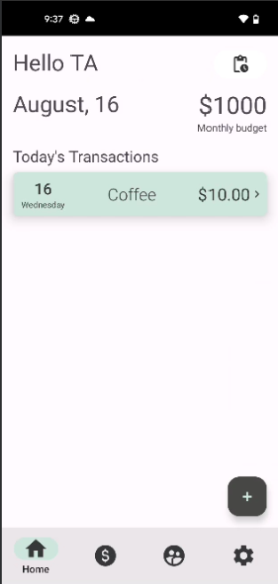
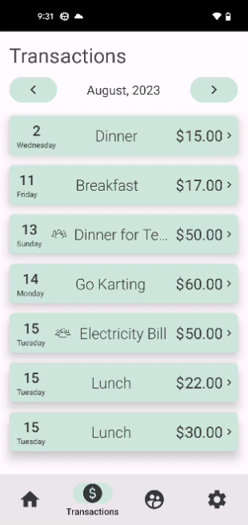

# Coinnect
Group expenses, simplified. Created by Dean Beebe, Prajwal Mathad, and Omkar Ubale.

## Project Description
Coinnect is a personal finance management application for Android users. We've aimed to solve the problem of many budgeting apps on the market today:
incorrect spend tracking when paying for group expenses (such as dinner, concert tickets, etc.).

## Images

